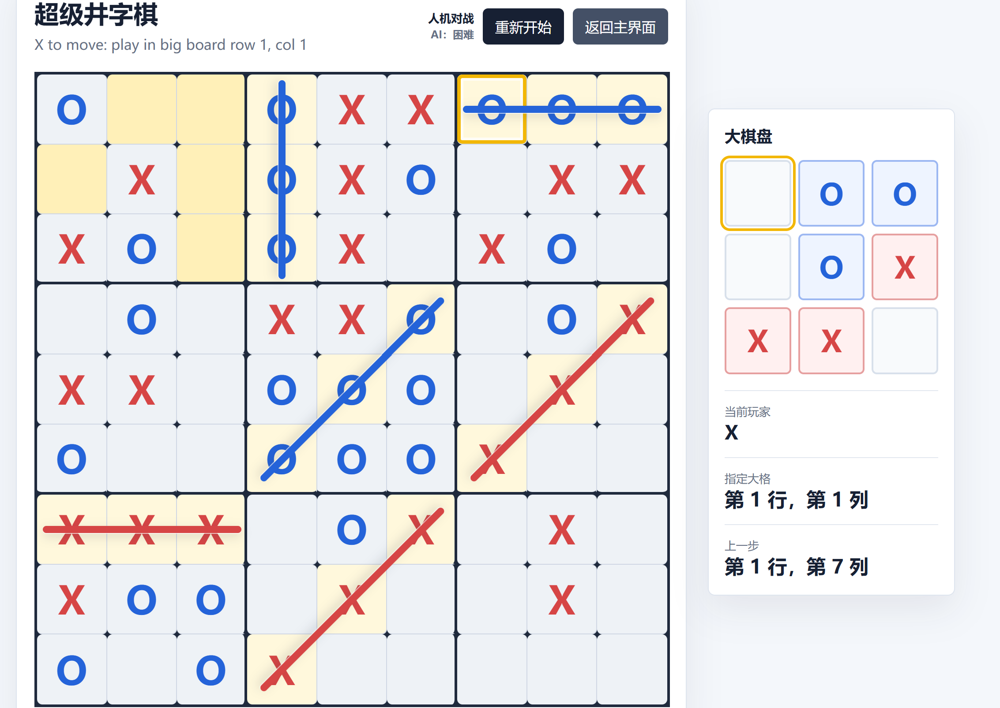
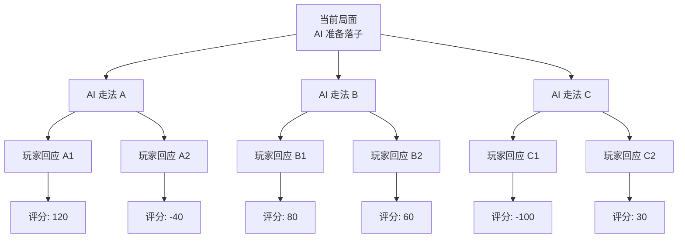

# Ultimate Tic-Tac-Toe 超级井字棋 ❌⭕


## 一.项目简介
本项目为数据结构与算法B大作业，是基于c++语言编程得到超级井字棋游戏，具体规则后面介绍。超级井字棋是一款基于传统井字棋的强推理益智类游戏。其中内置双人对战，AI人机对战模式，人机对战模式通过三个基于不同搜索算法的落子策略来区分强度(随机落子，局部贪心落子和Minmax算法+Alpha-Beta剪枝优化)，采取启发式评分方法。本项目采用前后端分离，后端入口与算法分离。
## 二.技术栈
- 网络层：用的是 Windows 的 Winsock2
- HTTP 服务：自己手写了 socket 监听、请求解析、响应返回
- AI：启发式评分 + minimax 搜索
- cpp语言：具体逻辑实现
- HTML：实现页面结构，按钮和棋盘
- CSS：网页外观和布局
- JavaScript：交互与前端逻辑
##  三.项目文件结构
```text
UltimateTicTacToe/
├─ README.md
├─ run_server.bat 
├─ frontend/ (前端页面、样式和交互逻辑)
│  ├─ index.html
│  ├─ style.css
│  └─ app.js
├─ backend_template/ (C++ 后端 HTTP 服务、游戏规则和 AI)
│  ├─ README.md
│  ├─ main.cpp
│  ├─ game_function.cpp
│  └─ 1.txt
├─ build/ (编译生成的可执行文件)
│  ├─ ultimate_ttt_server.exe
│  └─ ultimate_ttt_server_check.exe
├─ .git/
└─ .agents/
```

进入本文件夹后运行：

```bat
run_server.bat
```

脚本会优先使用 `g++`，找不到时尝试使用 Visual Studio 的 `cl`。成功后访问：

```text
http://localhost:8080
```
## 四.主界面与游戏界面



## 五.规则介绍与游戏机制解析

- **棋盘是 9x9，被分成 9 个 3x3 小棋盘。玩家在小棋盘内三连即可占领对应的大格。大棋盘上先三连的一方获胜,如果不存在大格三连，则占领大格多的一方获胜，若占领大格数依旧相同，则视为平局。**

- **每次落子所在的小格位置，决定对手下一步必须去对应的大格。如果目标大格已填满，对手可以在任意未结束大格落子。注意，一旦一个大格被占领，那么即使对方之后存在三连也无济于事。**

对于这个游戏有几个策略：
- 在游戏开始的初期可以抢占各个大格子的中心建立优势，并且要注意最好拿下中心的大格子。
- 后期重点要将对方的目标大格引到已经被占领的格子中，让他这一步棋走得毫无意义，这是获胜的关键
- 由于该游戏状态空间的有限性，其实在后期往往可以往后计算若干步骤，以此来推断落子位置。
- 如果默认双方都很聪明的话，事实上有不小的概率实现平局。

## 六.核心算法介绍

### 面向对象的棋盘设计
作为整个项目中唯一**可以称得上是手搓**的部分，我们来介绍一下棋盘得oop写法。
在 game_function.cpp 文件中，我们通过Mark类枚举了一个格子可能的4种状态（Empty, X, O, Draw），同时利用 board33 类来描述一个3×3的棋盘，并且在游戏类 game 中同样复用了这个board33 ，将大棋盘看成是3×3的二维数组，每个元素均为一个board33,并且对整个棋子的状态重建了一个board33 bigboard,通过bigboard的占领情况来判断整局的胜负,也是比较巧妙的。
对于是否被占领或者赢棋自然是在每一步落子得数据流之后不断分情况判断是否存在三联。
### Minimax 算法与 AI 搜索说明

本项目的人机对战 AI 没有使用训练模型，而是使用经典的 **Minimax 搜索算法**，并结合 **alpha-beta 剪枝** 和 **启发式局面评分函数**。

相关代码主要在 `backend_template/game_function.cpp`：

- `makeaimove()`：AI 落子入口
- `chooseaimove()`：选择 AI 要下的位置
- `minimax()`：递归搜索未来局面
- `evaluate()`：对当前棋局进行评分

**1. 核心思想**

Minimax 适合双人零和博弈，例如井字棋、五子棋、国际象棋等。

在本项目中：

- AI 希望让自己的局面分数最大
- 玩家希望让 AI 的局面分数最小
- AI 假设双方都会选择对自己最有利的落子

因此搜索过程分为两类节点：

```text
AI 回合：选择分数最大的走法
玩家回合：选择分数最小的走法
AI 会模拟未来几步：
AI 下一步
  -> 玩家可能的回应
    -> AI 再下一步
      -> 对局面进行评分
```
**2. MINMAX算法**
设置一个对局面的评估函数，AI算法要做的事情就是搜索不同的落子状态，在满足对手走法让局面评价函数最小的自身走法中的最大值。

**3.alpha-beta剪枝&&复杂度分析**
Minimax 的问题是搜索分支很多。Alpha-beta 剪枝可以减少不必要的搜索。
它维护两个值：
```
alpha：AI 当前已经能保证的最好分数
beta：玩家当前已经能保证的最好分数
```
Minimax 的时间复杂度约为：O(b^d)
其中：
- b 是每一层平均合法走法数量
- d 是搜索深度

**4.难度设计**
level = 1：简单
随机选择一个合法落子。

level = 2：普通
不进行深层搜索，只对每个候选落子后的局面调用 evaluate() 评分，选择当前看起来最好的位置。

level = 3：困难
使用 alpha-beta minimax 向后搜索几步，再用 evaluate() 评估叶子节点。

## 七. AI工具使用申明。
在该项目中绝大部分代码均由Codex辅助生成，其中纯手写的内容包括game_function.cpp的核心算法，如上面所述，虽然其亦经历了AI agent的优化。后端的接口，包括前端的实现均由AI完成，本人在阅读完代码并调试的基础上能一定程度确认代码的可用性与正确性。
在耗费10￥的额度情况下终于完成了该项目，可喜可贺。